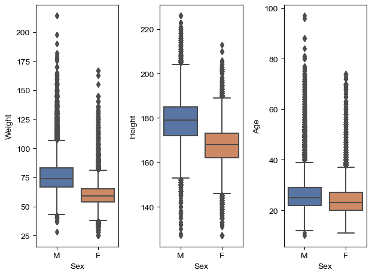
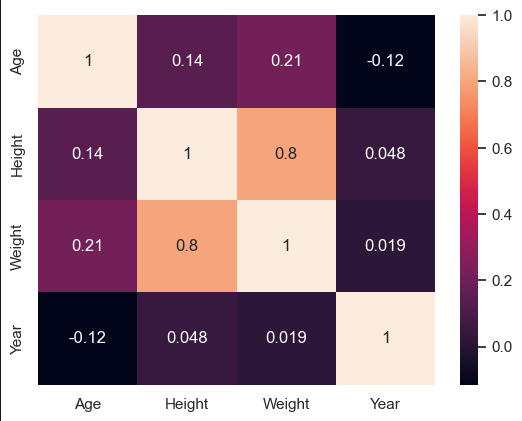
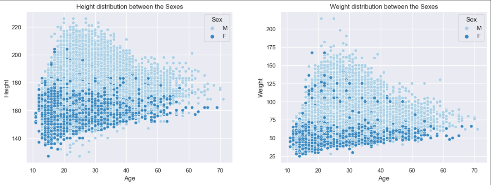
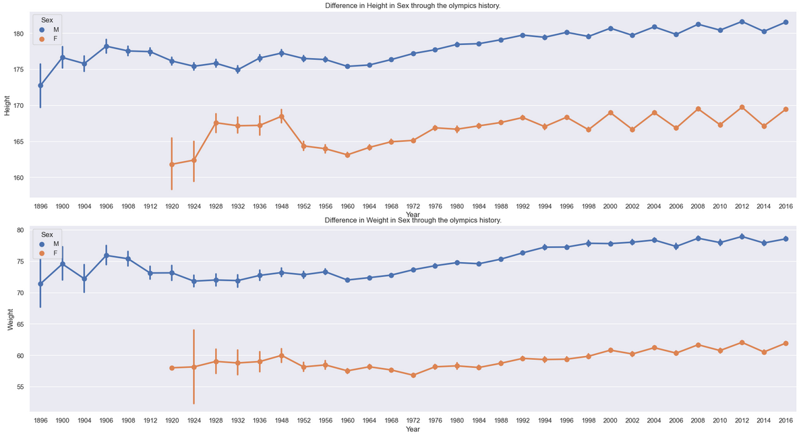
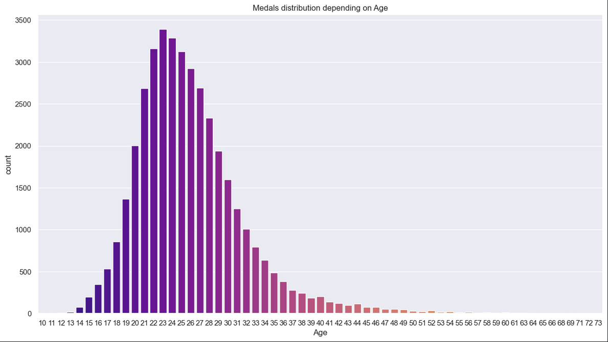
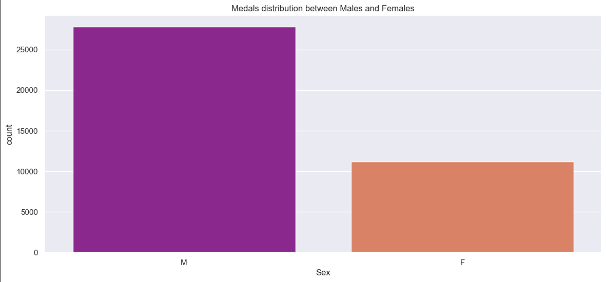
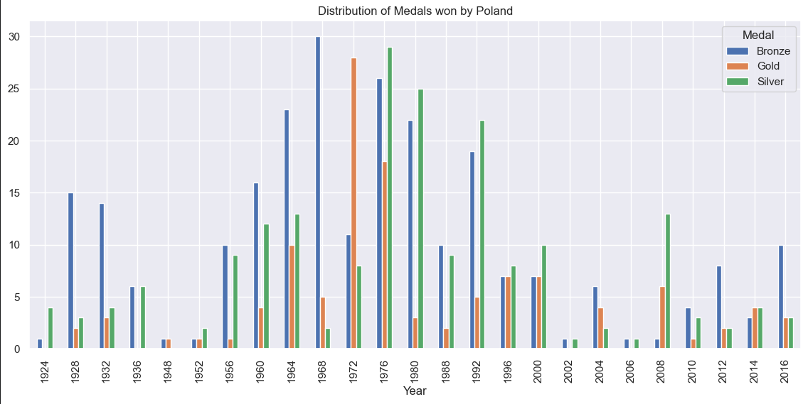
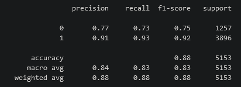

# Athlete events EDA & Machine Learning Model
-----------------------------------
### Process of creating project
- Data acquisition  - [LINK](https://www.kaggle.com/datasets/heesoo37/120-years-of-olympic-history-athletes-and-results?select=athlete_events.csv)
- Data cleaning and visualization
- Feature engineering
- Training a model
------------------------------------
### Technologies
- Python
- Pandas - data cleaning
- Matplotlib and Seaborn - data visualization
- Sklearn (GridSearchCV, Random Forest Classifier - model building
- Jupyter Lab - IDE
-----------------------------------

### Data visualizations

-----------------------------------

### Random Forest Model - report

Model predicts Sex of an Athletes based on Age, Height, Weight, Year

